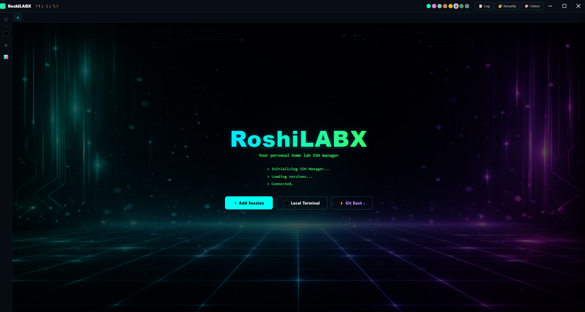
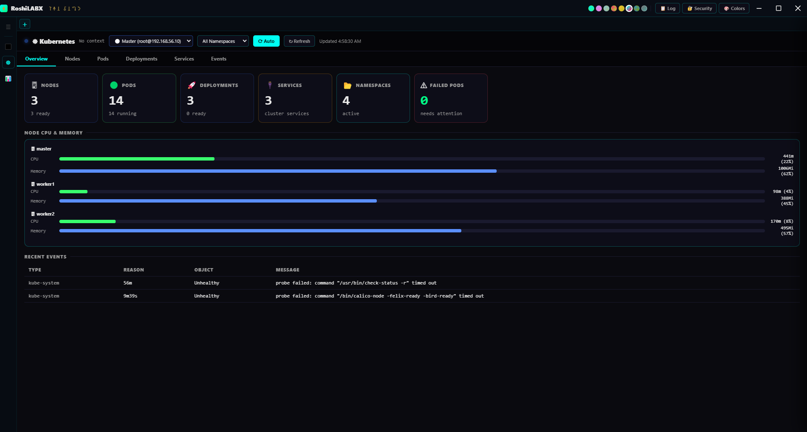
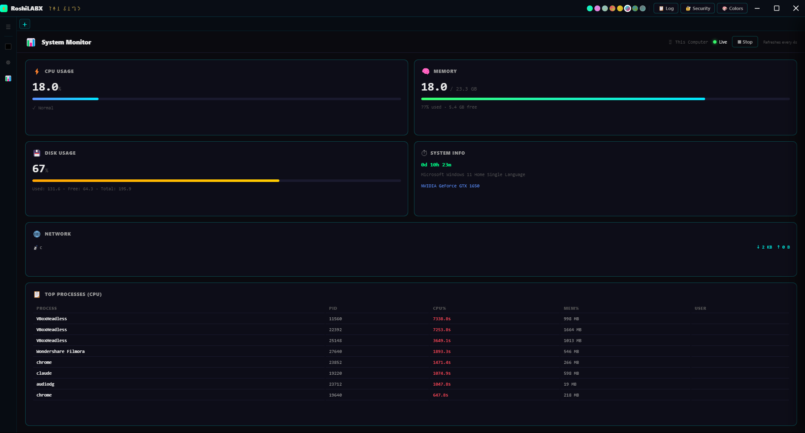
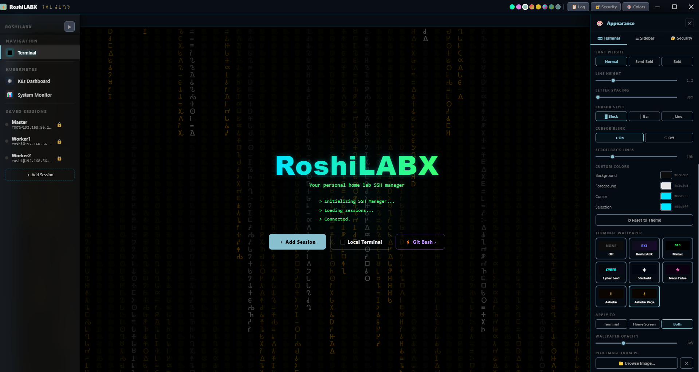
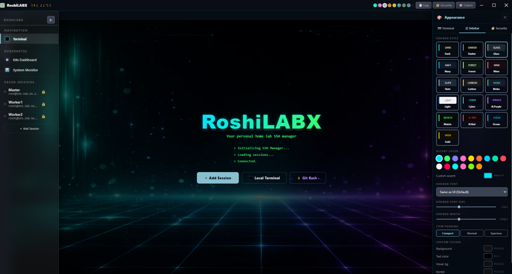

# RoshiLABX

<div align="center">

**Your personal home lab SSH manager**

*A cyberpunk-themed Electron desktop application for managing SSH sessions,*
*local terminals, Kubernetes dashboards, and system monitoring — built for home lab engineers.*

[](https://github.com)
[](https://electronjs.org)
[](https://nodejs.org)
[](LICENSE)

</div>

---

## Screenshots

<div align="center">

**Home Screen**


**Kubernetes Dashboard**


**System Monitor**


**Appearance & Themes**


**Sidebar & Session Management**


</div>

---

## Features

### SSH Management
- Save and manage multiple SSH sessions (password or private key auth)
- Host key verification — trust dialog on first connect, SHA256 fingerprint stored locally
- Host key mismatch detection — prompts user when server key changes (e.g. after VM rebuild)
- Known hosts sync — shares trust store between RoshiLABX and Git Bash OpenSSH
- Multi-tab SSH sessions — open multiple connections simultaneously
- Drag-and-drop tab reordering
- Reconnect, disconnect, and duplicate session tabs
- Color-coded session tags in sidebar
- Auth indicators in sidebar — 🔑 key auth · 🔒 password saved · ⚠ no credential

### Local Terminal
- Embedded Git Bash terminal powered by node-pty (real PTY, same engine as VS Code)
- Full xterm.js rendering with mouse support, copy on select, right-click paste
- Password auto-save — detects SSH password prompts, saves credential only after confirmed successful login
- Auto-types saved passwords silently on future connections (MobaXterm-style)
- Font resize via Ctrl+Scroll over the terminal
- Scrollback configurable up to 50,000 lines

### Credential Security
- All passwords encrypted at rest via Electron `safeStorage` → Windows DPAPI — no plaintext passwords on disk
- Credential saved only after confirmed successful login — never saved when login fails
- One-time migration — automatically encrypts any legacy plaintext passwords on first launch

### Security Panel (🔐 Security button in toolbar)
- View and delete individual saved credentials — shows `user@host:port` with DPAPI encrypted badge
- View and delete individual known host entries — shows key type and fingerprint
- View and delete individual SSH key files — ED25519 key pairs generated by RoshiLABX
- Clear All button for each category — full wipe in one click

### Kubernetes Dashboard
- Session selector dropdown — choose which saved session runs `kubectl` from the dashboard header
- Silent background SSH connection — connects to master node without opening a terminal tab
- Live cluster overview — node count, pod count, deployment status, namespace count
- Per-node CPU and memory bars with real-time Chart.js line graphs (last 20 data points)
- Nodes, Pods, Deployments, Services, and Events tabs with full table views
- Namespace filter — switch between All Namespaces and specific namespaces
- Auto-refresh every 10 seconds with manual refresh button

### System Monitor
- Accessible from the sidebar under Kubernetes section
- Local Windows monitoring — CPU%, memory, disk, uptime, OS info, GPU, top processes, network adapters
- Auto-starts when opened, refreshes every 4 seconds with live progress bars

### UI and Themes
- Glassmorphism across titlebar, sidebar, tabs, modals, and panels
- 15+ colour themes — Default, Dracula, Nord, Monokai, Gruvbox, Cyber, Solar, Glass, Midnight, Volcano, Ocean, Rose, Forest, Gold, Matrix, Moba
- 16 sidebar theme presets including Cyber, NeonPurple, Matrix, NeonRed, Ocean, Gold
- Custom accent color picker with 15 presets
- Custom terminal colors — background, foreground, cursor, selection
- Font family selector including Orbitron, Share Tech Mono, Rajdhani, Exo 2, Oxanium, Audiowide
- Font size, weight, line height, letter spacing, cursor style, cursor blink, scrollback — all adjustable
- Auto-hide sidebar with hover-to-peek — hover over the strip to reveal, mouse away to hide
- Keyboard shortcut Ctrl+B to toggle sidebar
- 📋 Log button in titlebar — opens log file directly in system editor

### Animated Wallpapers

| Theme | Description |
|-------|-------------|
| Matrix | Classic green rain — Latin + Katakana characters |
| Cyber Grid | Perspective grid with animated scan line |
| Starfield | Warp-speed star field |
| Neon Pulse | Neon glow ring pulses |
| RoshiLABX | Branded animated logo with floating particles |
| Ashoka | Ashokan Brahmi script rain — slow, readable, gold/amber |
| Ashoka Vega | Ashokan Brahmi script rain — Matrix speed, gold/amber |
| Custom Image | Pick any image from your PC as a wallpaper |

The Ashoka themes use the complete authentic Ashokan Brahmi Unicode block (3rd century BCE) — the exact characters from Emperor Ashoka's rock edicts, rendered using the Noto Sans Brahmi font. Your name is embedded as a watermark: 𑀭𑁄𑀰𑀦.

### Logging and Diagnostics
- Persistent log file at `C:\Users\YourName\AppData\Roaming\roshilabx\logs\roshilabx.log`
- Auto-rotates at 2MB — previous log saved as `roshilabx.old.log`
- Logs: app start/stop, SSH connection attempts, host key events, local terminal start/exit, storage errors, renderer JS errors, uncaught exceptions with full stack traces
- Never logs passwords, private keys, terminal content, or clipboard data

---

## System Requirements

| Requirement | Minimum |
|-------------|---------|
| OS | Windows 10 / Windows 11 (64-bit) |
| RAM | 4GB (8GB recommended) |
| Disk | 500MB free space |
| Node.js | v18 LTS or v20 LTS |
| Git for Windows | Latest stable |

---

## Prerequisites

Install these before cloning the project. Each one is required.

### 1. Node.js (v18 or v20 LTS)

Download: https://nodejs.org/en/download

Choose the LTS version. During install, check "Add to PATH".

Verify:
```powershell
node -v
npm -v
```

### 2. Git for Windows

Download: https://git-scm.com/download/win

Install with all default options. This provides Git Bash terminal, git command line, and OpenSSH client.

Verify:
```powershell
git --version
```

### 3. Visual Studio Build Tools 2022

Download: https://visualstudio.microsoft.com/visual-cpp-build-tools/

Click "Download Build Tools" then run the installer and select:
- Desktop development with C++
- Windows 10/11 SDK
- MSVC v143 build tools

This is required to compile node-pty which powers the local terminal. Without it the local terminal will not work.

After install, configure npm:
```powershell
npm config set msvs_version 2022
```

### 4. Python 3.x

Download: https://www.python.org/downloads/

During install check "Add Python to PATH".

> **Note:** Python 3.12+ removed the `distutils` module required by node-gyp. Run this after installing Python:
> ```powershell
> python -m pip install setuptools
> ```

Verify:
```powershell
python --version
```

---

## Installation and Running

### Step 1 — Clone the repository

```powershell
git clone https://github.com/roshilabx/RoshiLABX.git
cd RoshiLABX
```

### Step 2 — Install dependencies

```powershell
npm install
```

If you see errors about node-pty, make sure Visual Studio Build Tools are installed and retry.

### Step 3 — Run the app

```powershell
npm start
```

---

## Building a Windows Installer

```powershell
npm run build:win
```

> Run PowerShell as Administrator before building.

### Build Output

After a successful build the `dist/` folder contains:

| File | Description |
|------|-------------|
| RoshiLABX Setup 1.0.0.exe | NSIS installer with Start Menu shortcut |
| RoshiLABX 1.0.0.exe | Portable executable, no install needed |

---

## Project Structure

```
RoshiLABX/
├── src/
│   ├── main.js              # Electron main process
│   │                        # SSH connections (ssh2)
│   │                        # Local PTY terminal (node-pty)
│   │                        # IPC handlers
│   │                        # Known hosts store and sync
│   │                        # Credential store (safeStorage / DPAPI encrypted)
│   │                        # Persistent logger with rotation
│   ├── preload.js           # Context bridge (secure IPC API)
│   └── renderer/
│       ├── index.html       # Full UI — CSS themes, wallpapers, modals
│       └── app.js           # Renderer logic
│                            # Session management
│                            # Tab system with drag-and-drop
│                            # Terminal rendering (xterm.js)
│                            # K8s dashboard and Chart.js graphs
│                            # System monitor (local)
│                            # Security panel (credential manager)
│                            # Wallpaper animations
│                            # Host key trust dialogs
│                            # Settings and themes
├── screenshots/
│   ├── Main_screen.png
│   ├── k8s_Dashboard.png
│   ├── system_monitor.png
│   ├── Themes.png
│   └── Sidebar.png
├── assets/
│   └── icon.ico             # App icon (multi-size: 16 to 256px)
├── fonts/
│   └── NotoSansBrahmi-Regular.ttf
├── package.json
├── setup.bat                # Windows build script (run as Admin)
├── run.bat                  # Quick launch script
└── README.md
```

---

## Dependencies

### Runtime

| Package | Version | Purpose |
|---------|---------|---------|
| electron | ^28.0.0 | Desktop app framework |
| node-pty | ^1.0.0 | Real PTY for local terminal |
| ssh2 | ^1.15.0 | SSH2 client for remote connections |
| xterm | ^5.3.0 | Terminal emulator |
| xterm-addon-fit | ^0.8.0 | Auto-resize terminal |
| xterm-addon-canvas | 0.6.0-beta.37 | Canvas renderer for xterm |

### Dev

| Package | Version | Purpose |
|---------|---------|---------|
| electron-builder | ^24.0.0 | Build Windows installer and portable |

---

## Data Storage

RoshiLABX stores all data locally. Nothing is sent to any external server.

Windows path: `C:\Users\YourName\AppData\Roaming\roshilabx\`

| File | Contents |
|------|----------|
| sessions.json | Saved SSH sessions (passwords DPAPI-encrypted via safeStorage) |
| settings.json | UI preferences, theme, wallpaper |
| known_hosts.json | Trusted SSH host fingerprints |
| known_hosts | OpenSSH-format known hosts (for Git Bash sync) |
| credentials.json | Saved SSH passwords (DPAPI-encrypted via Windows safeStorage) |
| ssh_keys/ | Generated ED25519 key pairs |
| logs/roshilabx.log | Application log — current session |
| logs/roshilabx.old.log | Previous log (rotated when log exceeds 2MB) |

> These files are **not tracked by Git** — each machine has its own isolated data.

---

## Security

### Host Key Verification
- First connection shows a trust dialog with the server's SHA256 fingerprint
- Accepted fingerprints saved permanently to `known_hosts.json`
- On key mismatch (e.g. after VM rebuild), a warning dialog appears — user must explicitly accept the new key

### Known Hosts Sync
- Trust a host in RoshiLABX — Git Bash trusts it too
- Trust a host in Git Bash — RoshiLABX picks it up automatically via file watcher

### Password Storage
- All passwords encrypted using Electron `safeStorage` → Windows DPAPI (user-account-bound encryption)
- Passwords in `sessions.json` and `credentials.json` are never stored as plaintext
- Credential saved only after confirmed successful SSH login — wrong password attempts are discarded

### Logging
- Log file never contains passwords, private keys, terminal I/O, or clipboard contents
- Only connection metadata, errors, and app lifecycle events are logged

---

## Troubleshooting

### SSH shows "Host denied (verification failed)"
The server's host key has changed (common after VM rebuild). Open Edit Session, click **🔑 Clear Host Key**, then reconnect.

### node-pty fails to compile
```powershell
npm config set msvs_version 2022
python -m pip install setuptools
npx electron-rebuild -f -w node-pty --only node-pty
```

### node-gyp fails with "No module named distutils"
Python 3.12+ removed `distutils`. Fix:
```powershell
python -m pip install setuptools
npx electron-rebuild -f -w node-pty --only node-pty
```

### Build fails with "Cannot create symbolic link"
Run PowerShell as Administrator before running `npm run build:win`.

### Icon shows default Electron flask after install
```powershell
# Run as Administrator
taskkill /IM explorer.exe /F
Remove-Item -Force "$env:LOCALAPPDATA\IconCache.db" -ErrorAction SilentlyContinue
Remove-Item -Force "$env:LOCALAPPDATA\Microsoft\Windows\Explorer\iconcache*" -ErrorAction SilentlyContinue
Start-Process explorer.exe
```

### xterm-addon-canvas version not found
Ensure `package.json` has exactly:
```json
"xterm-addon-canvas": "0.6.0-beta.37"
```

### K8s dashboard shows "No Session Selected"
Select your master node from the session dropdown in the dashboard header. RoshiLABX will establish a silent background SSH connection — no terminal tab will be opened.

### Checking the log file
Click **📋 Log** in the titlebar to open the log file, or navigate to:
```
C:\Users\YourName\AppData\Roaming\roshilabx\logs\roshilabx.log
```

---

## Roadmap

- [ ] Pod log viewer — live streaming kubectl logs in a side panel
- [ ] Pod shell — one-click kubectl exec into any pod from the dashboard
- [ ] Grafana embed — webview panel pointing at your Grafana instance
- [ ] Port forward manager — start/stop kubectl port-forward tunnels from UI
- [ ] Helm releases tab in K8s dashboard
- [ ] SCP / SFTP file transfer panel
- [ ] Session groups and folders in sidebar
- [ ] Multi-hop SSH jump host support
- [ ] Terminal split view
- [ ] Linux and macOS support

---

## License

MIT License — see LICENSE for details.

---

## Author

**Roshan Wankhede** (𑀭𑁄𑀰𑀦 𑀯𑀸𑀦𑀔𑁂𑀤𑁂)

Built with love for home lab enthusiasts who live in the terminal.

---

*"The journey of a thousand servers begins with a single SSH connection."*
